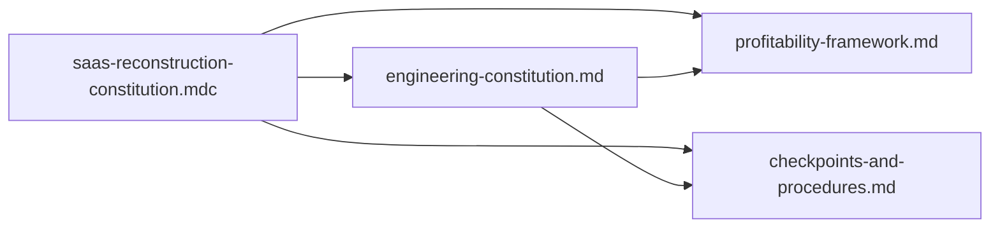

# SaaS reconstruction constitution — improvement areas

**Scope note:** This review uses the constitution stack on disk today: the always-applied rule file [`.cursor/rules/saas-reconstruction-constitution.mdc`](.cursor/rules/saas-reconstruction-constitution.mdc) (short contract) and the expanded [docs/engineering-constitution.md](docs/engineering-constitution.md), cross-checked against [docs/profitability-framework.md](docs/profitability-framework.md) and [docs/checkpoints-and-procedures.md](docs/checkpoints-and-procedures.md). If “uploaded today” differs on another branch, reconcile git history before adopting edits.

## What is already strong

- **Clear separation of concerns:** Roles, non-negotiables (tenancy, secrets, RBAC, audit), BYOT telephony constraints, and UI minimums are spelled out in [docs/engineering-constitution.md](docs/engineering-constitution.md).
- **Operational backbone:** CP1–CP6 in [docs/checkpoints-and-procedures.md](docs/checkpoints-and-procedures.md) maps cleanly to “design before code” and post-launch review—aligned with items 3, 8, and 10 in the `.mdc` rule.
- **Profit math is concrete:** [docs/profitability-framework.md](docs/profitability-framework.md) defines scoring, KPI pairs, and “definition of profitability-aligned change”—stronger than the single bullet “explicit impact” in the `.mdc`.

## Improvement areas (prioritized)

### 1) Align terminology across layers (reduce drift)

- The `.mdc` uses **“Architect → Review → Implement”** while [docs/engineering-constitution.md](docs/engineering-constitution.md) uses **“Propose → Review → Implement”** and checkpoints emphasize **CP3 sign-off before coding**. Pick one canonical phrase (recommend matching CP language) and mirror it in the `.mdc` so agents do not infer a different workflow.

### 2) Tie the short rule explicitly to CP + KPI mechanics

- Item 2 (“profitable outcomes … explicit”) is weaker than your checkpoints: CP1–CP2 already require **segment, KPI, baseline, guardrails**. Consider one bullet in the `.mdc` that says **work maps to CP1–CP6** and **primary + guardrail KPI** (per profitability framework), so agents do not stop at a vague “impact statement.”

### 3) Define “major work” and waiver paths (remove ambiguity)

- Both layers ban coding before design for **major** work but neither defines **major** (files touched, blast radius, migration, customer data, billing, auth). Add a short rubric (e.g., touches tenancy/auth/billing/data model/API contract → major; docs-only typo → not major).
- [docs/engineering-constitution.md](docs/engineering-constitution.md) allows **test waivers** with approval—there is no **who approves / template**. Add a one-line waiver rule (owner + rationale + follow-up task).

### 4) Reduce duplication without losing the always-on reminder

- Risk: the `.mdc` summary and [docs/engineering-constitution.md](docs/engineering-constitution.md) can diverge over time. Improvement options:
  - Keep `.mdc` as **only non-negotiables + pointers**, or
  - Add a **“constitution version / last reviewed”** footer in both places so “updated today” is auditable.

### 5) Close gaps on privacy, data lifecycle, and AI-adjacent risk

- Strong on **encryption / RBAC / audit**; lighter on **retention, deletion, export, subprocessors**—often required for real estate / lead data and multi-tenant SaaS. Even a short subsection on **data minimization + tenant offboarding** would reduce regulatory and incident risk.
- If humans/agents will handle **PII in prompts/logs**, add an explicit **no PII in agent logs / redaction** rule (ties to tenant-safe diagnostics you already require).

### 6) Make quality gates machine-checkable where possible

- **WCAG AA** and **screenshot parity** are stated; improvement is to say **how** they are proven in CI/PR (e.g., automated axe on critical routes + manual checklist for complex widgets). Same for **security checks**—point to existing scripts or require `checks:ci` / secret scanning in PR template.

### 7) Billing parity with BYOT telephony clarity

- BYOT telephony is precise (delegated Twilio Connect). **Billing** is mentioned as tenant-aware but not at the same level of **delegated vs platform-liability** patterns (e.g., Stripe Connect-style assumptions). A short parallel bullet reduces accidental platform-owned payment liability.

### 8) Incident and observability closure

- Observability is covered in engineering constitution §10/§12; improvement is **explicit incident triggers**: what constitutes rollback (tie to profitability framework **stop-loss** and CP5 **rollback trigger**—they exist but could be cross-linked in the `.mdc`).

## Suggested follow-up (after you approve edits)

- Normalize wording **Architect vs Propose** across `.mdc` and engineering constitution.
- Add **rubrics** (major vs minor; waiver approver) and optional **version stamp**.
- Optionally extend engineering constitution with **data lifecycle / AI logging** bullets—not boilerplate policies, but repo-specific constraints.
