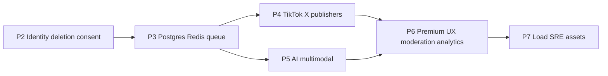

# Marketer Pro: P2 through P7 execution plan

## Scope reality (aligned with “top quality, couple weeks”)

- **P2 alone** (identity + deletion + consent + dual OAuth) is **2–3 engineering weeks** at production bar (tests, edge cases, Expo + web parity).
- **P3–P7** (Postgres, Redis/BullMQ, TikTok/X, multimodal AI, drag-drop, 10k load) are **months** cumulative; the plan below sequences them so you can **finish P2 completely**, then **start P3** without rework.

---

## Current baseline (constraints)

- Auth today: email/password only in [apps/api/src/auth/auth-api.ts](apps/api/src/auth/auth-api.ts); JWT via [apps/api/src/auth/jwt.ts](apps/api/src/auth/jwt.ts) (`jose` HS256).
- [`users`](apps/api/src/marketer-pro/database.ts) has **`password_hash TEXT NOT NULL`** — OAuth-only accounts need either **nullable `password_hash`** or a separate **identities** table (recommended: **`user_oauth_identities`** + nullable password for password users).
- Web: Vite + React [apps/web/src/App.tsx](apps/web/src/App.tsx). Mobile: Expo [apps/marketer-pro-mobile/App.tsx](apps/marketer-pro-mobile/App.tsx).
- Architecture reference: [docs/marketer-pro-target-architecture.md](docs/marketer-pro-target-architecture.md) §8.

---

## P2 — Identity upgrade (store-critical) — **do this first**

### P2a — Data model and account deletion

- **Migration** in [apps/api/src/marketer-pro/database.ts](apps/api/src/marketer-pro/database.ts) `migrate()`:
  - Add `user_oauth_identities` (or equivalent): `user_id`, `provider` (`apple`|`google`), `provider_subject` (unique per provider), `email_snapshot`, `created_at`.
  - Make **`users.password_hash` nullable** for OAuth-only users (existing rows stay valid).
  - Add **`users.ai_consent_at`** (TEXT ISO nullable) and optionally **`users.ai_consent_version`** (INTEGER).
- **`DELETE /api/v1/auth/account`** (Bearer required):
  - Load `wid` from JWT; in a **transaction**: delete/revoke dependent rows (memberships, workspace cascade already partially OK via FKs—verify `ON DELETE CASCADE` on all tenant tables), clear **social_connections** and **oauth_states** for workspace, delete **user** and orphan workspace if sole owner (match product rule: “delete my account” = delete user + owned workspace data).
  - Return `204` or `{ deleted: true }`.
- **Tests**: extend [apps/api/src/index.test.ts](apps/api/src/index.test.ts) or add `auth-api.test.ts` for delete + FK behavior; keep [apps/api/src/marketer-pro-api.test.ts](apps/api/src/marketer-pro-api.test.ts) green.

### P2b — AI transparency and consent

- **`PATCH /api/v1/auth/me/consent`** or **`POST /api/v1/marketer/ai-consent`** with body `{ accepted: boolean }` — sets `ai_consent_at` (and decline clears or stores declined—pick one policy and document in env doc).
- **Web**: first-visit modal (localStorage gate) + Settings section; show disclosure string required for store review.
- **Expo**: same flow with `AsyncStorage`.
- **Contract**: optional fields on marketer state in [packages/marketer-pro-contract/src/index.ts](packages/marketer-pro-contract/src/index.ts) if UI reads consent from API.

### P2c — Sign in with Apple (backend + iOS)

- **Backend**: `POST /api/v1/auth/apple` with `{ identityToken, nonce? }` — verify Apple JWT using **Apple JWKS** (`jose` `createRemoteJWKSet`), `iss`, `aud` (Services ID / bundle ID per env), `sub` stable id → upsert **user_oauth_identities**, link or create user + workspace (mirror register transaction).
- **Env**: `APPLE_CLIENT_ID` (Services ID), optional team/key overrides documented in [docs/marketer-pro-env.md](docs/marketer-pro-env.md).
- **Expo**: `expo-apple-authentication` in [apps/marketer-pro-mobile](apps/marketer-pro-mobile); **only enable on iOS** builds.

### P2d — Google Sign-In (backend + cross-platform)

- **Backend**: `POST /api/v1/auth/google` with `{ idToken }` — verify via **Google tokeninfo** or certs (`jose`), extract `sub`, `email`; same upsert/link rules as Apple.
- **Env**: `GOOGLE_CLIENT_ID` (Web client + iOS/Android client IDs as needed).
- **Web**: Google Identity Services button or OAuth popup flow (minimal iframe/button in Settings / Sign-in panel).
- **Expo**: `expo-auth-session` + Google provider.

### P2e — Phone OTP (optional within P2)

- **If** Twilio (or similar) is acceptable: `POST /api/v1/auth/otp/send`, `POST /api/v1/auth/otp/verify` storing pending codes in SQLite with TTL + rate limit.
- **If** budget/env not ready: **defer to P2.1** and document gate in target-architecture doc—**do not** block Apple/Google/deletion on OTP.

### P2f — QA gate

- **Vitest**: full `npm test`.
- **Playwright**: [apps/marketer-pro-e2e/tests/marketer-smoke.spec.ts](apps/marketer-pro-e2e/tests/marketer-smoke.spec.ts) — add flows only where stable in CI (e.g. email login still works; OAuth smoke may need mocked tokens or dedicated stub env).

---

## P3 — Postgres + Redis/BullMQ (after P2 merges)

- Introduce **Postgres** as source of truth (Drizzle/Prisma/Knex—pick one; align with team preference).
- **Dual-write or migration script** from SQLite for dev convenience; production targets Postgres only.
- Extract **publish pipeline** from [apps/api/src/marketer-pro/publish-queue.ts](apps/api/src/marketer-pro/publish-queue.ts) into **BullMQ workers** (Redis): retries, backoff, dead-letter.
- **Docs**: deployment topology in target-architecture doc.

---

## P4 — Multi-network publisher (Meta already present)

- TikTok Content Posting API + X API v2 workers sharing job schema from P3.
- Unified **outbound job** table + idempotency (reuse patterns from `publish_jobs`).

---

## P5 — AI expansion

- Router: Claude vs GPT vs template in [apps/api/src/marketer-pro/generation.ts](apps/api/src/marketer-pro/generation.ts).
- Image pipeline (Replicate/SD) behind paid tier; async jobs via P3 queue.

---

## P6 — Premium UX

- Drag-drop calendar (web component library), brand RAG (upload → embeddings), moderation **pre-post** agent.

---

## P7 — Scale and store assets

- k6/Artillery load tests; Sentry/logging; **screenshots and preview video** per store guidelines.

---

## Execution order for “watching” sessions

1. Land **P2a–P2b** (schema + delete + consent API + minimal UI) — **highest store value**.
2. Land **P2c–P2d** (Apple + Google) with tests using **mocked ID tokens** where possible.
3. **OTP** only if env keys exist; else skip and tag issue.
4. Re-run **E2E** ([scripts/e2e-marketer-webserver.mjs](scripts/e2e-marketer-webserver.mjs) + [apps/web/vite.config.ts](apps/web/vite.config.ts) host binding already fixed).
5. Branch **P3** only after P2 is merged and stable—avoid dual migration pain.

---

## Risk notes

- **Apple Sign-In + Google on same app**: Apple may require Sign in with Apple if other third-party logins exist on iOS—plan implements Apple **before** or **with** Google on mobile.
- **SQLite + OAuth**: fine for P2 dev; P3 Postgres before horizontal scale.
