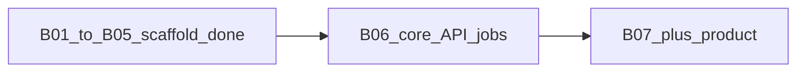

# SaaS reconstruction progress report

**Authoritative status file:** [docs/reconstruction-source-of-truth.md](docs/reconstruction-source-of-truth.md) (reconcile any conflict with [START_HERE.md](START_HERE.md) in favor of the source-of-truth doc).

**Repository snapshot (from source-of-truth):** last validated **2026-05-07**, branch **`b01-bootstrap-upgrades`**. [START_HERE.md](START_HERE.md) also references active work on that branch and PR #16 to `Home-Link-Realty-Group/Wholesaler-Pro`.

---

## Where you are on the linear backlog

Dependency order from [docs/reconstruction-backlog.md](docs/reconstruction-backlog.md): `B01 → B02 → B03 → B04 → B05 → B06 → B07+` (B07–B10 product; B11–B12 hardening/release).

| ID | Name | Status (per source-of-truth + START_HERE) |
|----|------|-------------------------------------------|
| **B01** | Monorepo bootstrap | **Complete** — CP4 baseline; `npm run bootstrap:check` was the validation gate. |
| **B02** | Multi-tenant domain/data contract | **Complete** — CP4 foundation (contracts/scaffolds; no migrations). |
| **B03** | Auth/access foundation | **CP4 implementation done; “ready for sign-off”** — runtime guards, audit baseline, tests; `npm run b03:check` is the focused gate. |
| **B04** | Billing/subscription skeleton | **CP4 skeleton landed** — webhook envelope, stub signature verifier, in-memory idempotency, tests; **not production-grade** signatures/idempotency. [START_HERE.md](START_HERE.md) says **“intake ready for sign-off.”** |
| **B05** | BYOT telephony Connect baseline | **CP4 bounded skeleton in repo** — delegated callback envelope, stub verifier, `telephony.connect` RBAC capability ([docs/reconstruction-source-of-truth.md](docs/reconstruction-source-of-truth.md)). Note: [START_HERE.md](START_HERE.md) line “B05+: not started” is **stale** relative to the source-of-truth doc. |
| **B06** | Core API and job runtime | **Pending** — next dependency after B05 stabilization per backlog. |
| **B07+** | Seller intake, offer pipeline, SEO layer, operator workspace, etc. | **Not started** as implementation backlog items. |

**Plain-language position:** You are **past the first five foundation slices** (bootstrap → tenant contracts → auth scaffolding → billing webhook stub → BYOT connect stub). You have **not** yet built the **core durable runtime** (**B06**) or **any revenue product flows** (**B07+**). The live marketing SPA under `src/` is **not** treated as the reconstruction implementation surface in the canonical narrative—the scaffold is **`apps/` + `packages/`**.

---

## What exists vs what does not (explicit in repo)

**Present (validated claims in source-of-truth):**

- Governance/docs ([README.md](README.md), constitution, checkpoints, [docs/v0.0.2.md](docs/v0.0.2.md), etc.).
- Workflow intake: large **`workflows/`** corpus + conversion scripts (`npm run workflows:convert`, `clean`).
- **Bounded API/contracts** under [apps/api](apps/api) and [packages/contracts](packages/contracts): health, tenant ingress patterns, billing webhook skeleton, BYOT connect skeleton—not a full production platform.

**Called out as not present / unverified:**

- End-user product SPA as described in “historical chats.”
- **Infrastructure-as-code / active deployment config** for the reconstructed app.
- **Production data migrations**, durable persistence layer, production edge middleware (see blockers below).

---

## Current blockers (from source-of-truth)

- No **auth/session runtime middleware** at the request edge yet.
- B03 **privileged-action audit sink is in-memory only** (no external transport).
- Audit correlation relies on **caller-provided request metadata** (no integrated edge collector).
- Local **GitHub CLI** not configured for issue/PR queries (operational, not code).

---

## Sign-offs and automated validation hygiene

- **Checkpoint sign-offs** must appear in [docs/reconstruction-sign-off-log.md](docs/reconstruction-sign-off-log.md) (policy effective **2026-05-07**). Current log: **one legacy summary row**; **no post-policy named human signer rows** yet—so formal multi-role approvals may still be outstanding even where work items say “ready for sign-off.”
- **Test gate history** is thin in [docs/test-completion-log.md](docs/test-completion-log.md) (only a 2026-05-07 bootstrap row with gates skipped for doc-only work). Day-to-day execution detail lives in [docs/reconstruction-execution-log.md](docs/reconstruction-execution-log.md) (e.g. 2026-05-04–05 sessions).

---

## Visual: backlog position

---

## If you want this report to stay “exact” going forward

1. Keep [docs/reconstruction-source-of-truth.md](docs/reconstruction-source-of-truth.md) updated on every meaningful merge (and align [START_HERE.md](START_HERE.md) so B05 wording matches).
2. Append rows to [docs/test-completion-log.md](docs/test-completion-log.md) after real gate runs (`bootstrap:check`, `b03:check` when relevant, `checks:ci`).
3. Record human/AI sign-offs in [docs/reconstruction-sign-off-log.md](docs/reconstruction-sign-off-log.md) per policy when CP gates close.

No code or doc edits are proposed here; this is a read-only synthesis of canonical files.
